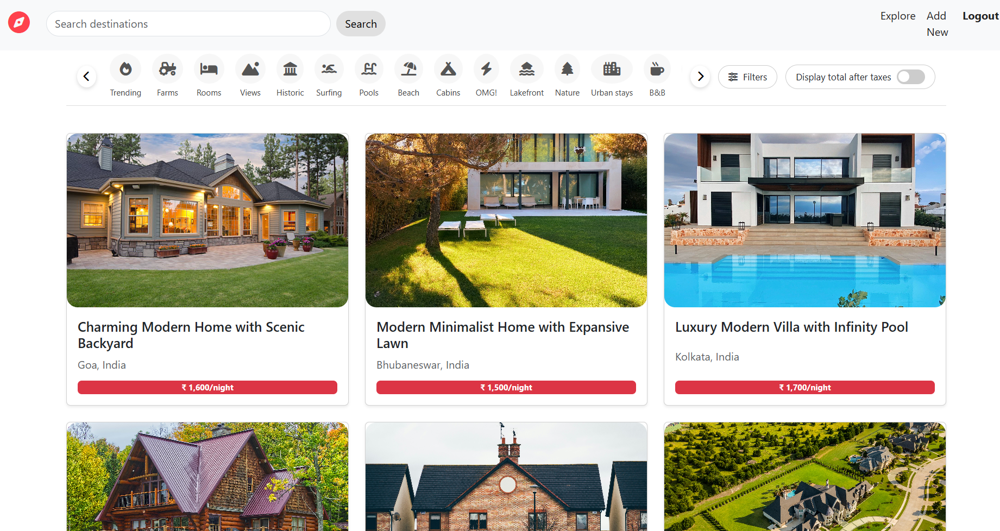

# 🌍 VoyaStay

A beautiful, responsive web app for discovering and listing unique places to stay around the world. Built with Node.js, Express, EJS, and Bootstrap, VoyaStay offers a seamless experience on both desktop and mobile devices.

---

## ❓ Why the name VoyaStay?

**VoyaStay** is a blend of the words **"voyage"** (meaning a journey or travel) and **"stay"** (a place to rest or lodge). The name reflects the platform’s mission: helping travelers find unique and memorable places to stay on their journeys. It’s modern, easy to remember, and perfectly captures the spirit of adventure and comfort that the site offers.

---

## 🚀 Live Demo

Check out the live app here: [https://wanderlust-2mwj.onrender.com/listings](https://wanderlust-2mwj.onrender.com/listings)

---

## ✨ Features

- 🏠 Browse and search unique listings from around the world
- 📱 Fully responsive design for mobile and desktop
- 💬 Leave reviews and ratings for listings
- 👤 User authentication (sign up, login, logout)
- 🖼️ Add new listings with images
- 🌟 Modern, attractive UI with custom navigation and footer
- 🔒 Secure authentication and user management

---

## 🚧 Planned Features

- 🔍 **Powerful Search Bar:** Instantly find listings by location, name, or keyword (coming soon)
- 🗂️ **Advanced Filtering:** Filter listings by price, amenities, and more (coming soon)
- 🗺️ Interactive map view for listings
- 📅 Booking and availability calendar
- 📧 Email notifications and messaging

---

## 📸 Screenshots

> _Add your own screenshots here!_

| Home Page (Desktop) | Home Page (Mobile) |
|--------------------|--------------------|
|  |  |

---

## 🛠️ Tech Stack

- **Backend:** Node.js, Express.js
- **Frontend:** EJS, Bootstrap 5, custom CSS
- **Database:** MongoDB (Mongoose)
- **Authentication:** Passport.js
- **Icons:** Font Awesome

---

## 🚀 Getting Started

1. **Clone the repository:**
   ```sh
   git clone https://github.com/Satya-0023/VoyaStay.git
   cd VoyaStay
   ```
2. **Install dependencies:**
   ```sh
   npm install
   ```
3. **Set up environment variables:**
   - Create a `.env` file for your MongoDB URI and any API keys you use.
4. **Run the app:**
   ```sh
   npm start
   ```
5. **Visit:**
   - Open [http://localhost:3000](http://localhost:3000) in your browser.

---

## 🙏 Credits

- Inspired by Airbnb and modern travel platforms
- Built with 💖 by Satya-0023
- Thanks to all open-source contributors and the Node.js community

---

## 📬 Contact

For questions, suggestions, or contributions, feel free to open an issue or reach out via [GitHub](https://github.com/Satya-0023). 
